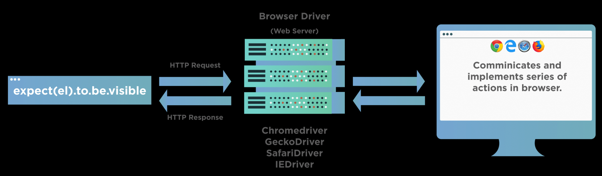
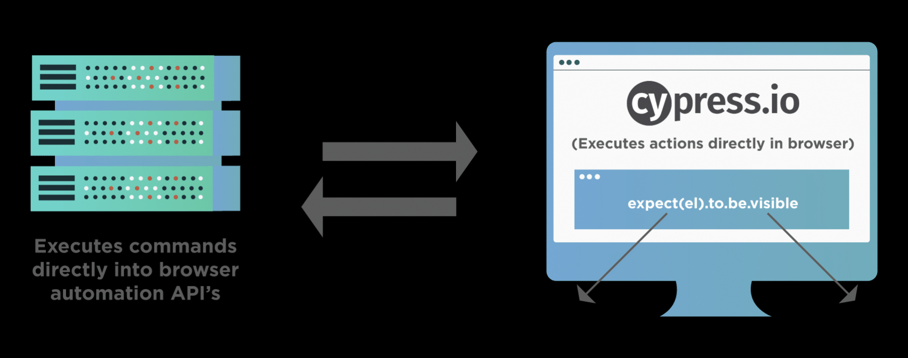
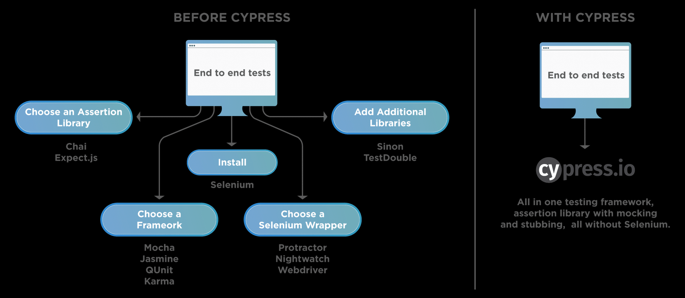
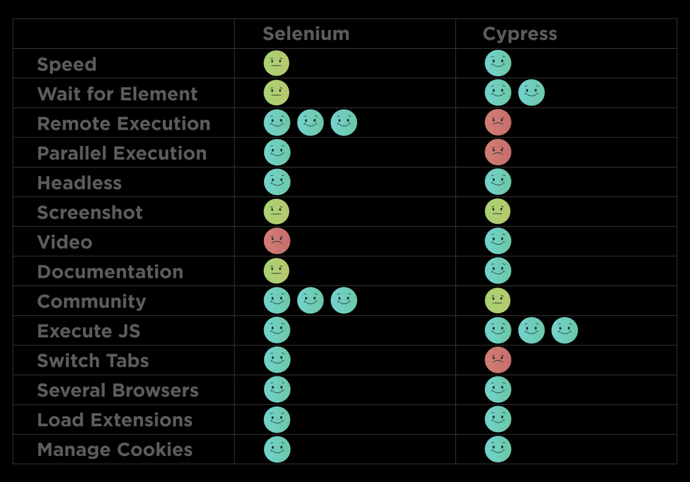

## **Cpress**

#### Revelant Docs:

[Official Docs](https://www.cypress.io/)

[Tooksqa course](https://www.toolsqa.com/cypress/what-is-cypress/ "tooksqa")

[Cypress Course](https://cypress-course.vercel.app/)

## What is Cypress?

Cypress is a **next-generation front-end testing framework** designed for modern web applications. It allows developers to write automated tests for user interactions and backend processes, providing a comprehensive solution for end-to-end testing. Built on top of JavaScript, Cypress is particularly appealing to developers familiar with web development technologies due to its intuitive syntax and API.

## Key Features of Cypress

1. ***Unique Architecture***

Cypress operates directly within the browser, bypassing the need for Selenium WebDriver. This unique architecture allows Cypress to listen and modify browser behavior at runtime, providing faster and more reliable test execution.

NOTE

2. ***Automatic Waiting***

One of the standout features of Cypress is its **automatic waiting** capability. This eliminates the need for manual timeouts, enhancing test reliability and speed. Cypress automatically waits for commands and assertions to complete before proceeding, simplifying the handling of asynchronous tasks.

3. ***Real-time Reloading***

Cypress offers  **real-time reloading** , ensuring that tests stay up-to-date with code changes. This feature streamlines the development process by providing immediate feedback on test results.

4. ***Time-travel Debugging***

Cypress includes a **time-travel debugging** feature that allows developers to step through each command in a test. This capability helps in observing the state of the application at different points in time during test execution, aiding in pinpointing and resolving issues effectively ^[1](https://www.bing.com/ck/a?!&&p=f741977d47bb29a373e17575a02f3272044b60fbe7e545cf05e47715d462876aJmltdHM9MTc1MTE1NTIwMA&ptn=3&ver=2&hsh=4&fclid=2af470c9-ce56-6753-3daa-6531cfd46668&u=a1aHR0cHM6Ly93d3cuZ2Vla3Nmb3JnZWVrcy5vcmcvaW50cm9kdWN0aW9uLXRvLWN5cHJlc3MtdGVzdGluZy1mcmFtZXdvcmsv&ntb=1)^ .

5. ***Network Stubbing***

Cypress allows  **network stubbing** , enabling developers to mock server responses for predictable and efficient testing. This feature is particularly useful for testing edge cases and scenarios that are difficult to reproduce in a live environment

## Components of Cypress

1. ***Test Runner***

The **Test Runner** is a pivotal component of Cypress, providing a user-friendly interface for writing, managing, executing, and debugging tests. It offers real-time test execution and comprehensive error reporting, enhancing productivity and confidence in test outcomes  .

2. ***Cypress Dashboard***

The **Cypress Dashboard** is a cloud-based service for test recording, parallelization, and analytics. It provides insights into test runs and helps in tracking the status and performance of the test suite

## **Comparison with Selenium**

Cypress differs from Selenium in several key aspects:

* **Execution Environment** : Cypress runs directly in the browser, whereas Selenium relies on a remote WebDriver for browser control  .
* **Speed and Reliability** : Cypress offers faster and more consistent test execution due to its architectural design  .
* **Support for Modern Frameworks** : Cypress provides built-in support for modern JavaScript frameworks, simplifying setup and configuration

## drawbacks of Cypress

* It is  **relatively naive** , and it does not have the vast community that Selenium does. But in recent years, it has gained momentum, and the Cypress community is increasing at a great pace.
* As stated earlier, it's JavaScript or bust. You will not be able to write cypress tests in the old static languages such as C# and Java. On the contrary, as these days, JavaScript is one of the biggest buzzwords for frontend developments, using the same language for test automation bridges the gap between the developers and the QAs.
* Because it runs inside the browser, there **is no support** for **multiple** browser  **tabs or popups** . You cannot use **Cypress** to drive two browsers instances at the same time.
* Before Cypress 4.0.0, it used to support only Chrome and Electron. **Cypress 4.0.0** includes support for **Mozilla Firefox** browsers (beta support) and **Microsoft Edge** (Chromium-based) browsers, which is a big step forward for Cross Browser Testing in Cypress.
* No shadow DOM support. You can imagine the shadow DOM as a " **DOM within a DOM** ". It is its own isolated DOM tree with its elements and styles, completely isolated from the original DOM. Also, even Selenium does not provide explicit support for working with Shadow DOM elements.
* It **doesn't** support native **mobile** apps, but it **does** intend to support **mobileweb browsers** in the future*.*

## **Setting up Cpress with React-Vite with TypeScript **

[stackoverflow](https://stackoverflow.com/questions/76131497/when-setting-up-cypress-configfile-is-invalid)

Rename the file ***cypress.config.ts* **to ***cypress.config.mjs***

### Reasons

cypress.config.mjs informs nodejs that **This is an ES Module**

**File extension**

* `.cjs` → CommonJS
* `.mjs` → ES Module
* `.ts` → ambiguous, depends on transpiler or how it's loaded

**package.json** `"type"` field

* `"type": "module"` → `.js` files are treated as ESM
* `"type": "commonjs"` → `.js` files are CommonJS

 **How Cypress loads config files** :

* Cypress expects config files to be **CommonJS (`.js` or `.ts` with `module.exports`)**
* If you use  **ESM syntax (`export default`)** , Cypress can fail **unless it knows for sure you're using an ES Module file**

By renaming the file to `cypress.config.mjs`, you  **clearly indicated to Node.js and Cypress** :

    👉 "This is a pure ES Module. Use ESM rules (like allowing`import` and `export`)."

Cypress saw that, respected the extension, and used `import` internally instead of `require()` — fixing the `exports is not defined` error.

Why Cypress didn’t like `cypress.config.ts`

* TypeScript files (`.ts`) are not directly understood by Node.js without being compiled or interpreted.
* Cypress tries to `require()` the `.ts` config file (as if it's CommonJS), which **fails if you're using `export`** (ESM syntax).
* Your `tsconfig.json` has `module: "ESNext"`, so TypeScript treated it as an ES Module, but Cypress didn’t — causing the mismatch.

## What are the common differences between Selenium and Cypress?

.....kklk
